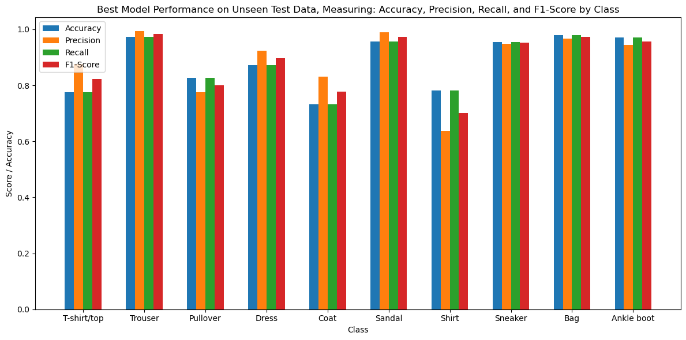

# Creating a custom sequential model through Keras tuner hyperparameter tuning for classifying fashion product images

## Non-technical explanation of the project

This project focuses on improving the accuracy of a computer program designed to classify fashion product images, such as clothing. The goal is to enhance the program's ability to distinguish between various fashion items by fine-tuning key parameters, including the size of input layers, choice of activation functions, optimizer type and the learning rate of the optimizer. The primary objective is to determine the optimal configuration for these parameters, enabling more effective recognition of fashion products within images. This project has practical applications in e-commerce for accurate product categorization and recommendation, aiding fashion designers and retailers in efficiently organizing their product catalogues.

## Data

The dataset utilised for this project is Fashion MNIST, a popular benchmark dataset in the field of computer vision. Fashion MNIST consists of grayscale images of fashion items, each belonging to one of ten categories, including items like T-shirts, dresses, and shoes.

## Model

This project constructs a custom Sequential model using Keras tuner for this task. This Sequential model is a stack of one flattened input layer and three dense layers the last of which is the output layer. The first two dense layers' architecture, including the number of neurons and activation functions, is determined through hyperparameter tuning. The model is then compiled using an optimized configuration, which includes an optimizer type and learning rate value that are both determined through hyperparameter tuning. The goal is to find the most effective combination of these hyperparameters for accurate classification.

## Hyperparameter Optimisation

The following hyperparameters are tuned using Keras tuner:

Dense Layer Sizes: The number of neurons (units) in each of the three dense layers is a critical factor affecting the model's capacity to learn complex patterns. Through hyperparameter tuning, different configurations are explored for these layer sizes to determine the optimal combination.

Activation Functions: The choice of activation functions for each dense layer significantly impacts the model's ability to capture intricate features in the data. The hyperparameter tuning process investigates various activation functions, such as ReLU and tanh, for each dense layer to identify the most effective combination.

Learning Rate: The learning rate is a key hyperparameter governing the step size during model training. I conducted hyperparameter tuning to find the optimal learning rate value that ensures rapid convergence without overshooting.

Optimizer Type: Different optimization algorithms, including Stochastic Gradient Descent (SGD), Adam, RMSprop, and Nadam (Adam with Nesterov momentum), are explored during hyperparameter tuning. Each optimizer type has unique characteristics, and I aimed to identify which one works best for this specific image classification task.

By systematically exploring and optimizing these hyperparameters, the project aims to create a custom Sequential model that excels in classifying fashion product images within the Fashion MNIST dataset.

## Results
The best model found through the hyperparameter tuning method managed to achieve an accuracy of 89.15% on unseen test data, here is a breakdown of these results including the accuracy, precision, recall, and F1-Score across the 10 different classes in the Fashion MNIST dataset.

## Contact Details

Email: jacob.9.thomas@gmail.com
LinkedIn: www.linkedin.com/in/jacob-thomas-092402242
