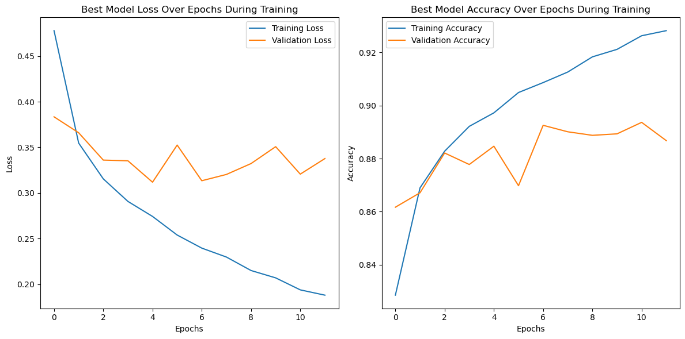

# Model Card

The model described in this card is designed to classify fashion product images, particularly items of clothing. Its primary function is to analyse images and categorise them into different fashion product classes. The model does not identify specific individuals or demographics; instead, it focuses solely on recognising and categorising fashion products within images.

This model card provides information on the model's performance across various aspects, including its ability to classify different types of fashion products and its performance on different subsets of fashion images.

## Model Description

**Input:** Fashion product images

**Output:** Predicted fashion product category

**Model Architecture:** 

The model is a Sequential neural network consisting of the following components:

Input Layer: The model begins with an input layer, which is a flattening layer. It reshapes the input images, which have dimensions of 28x28 pixels, into a flat vector of 784 values. 

Hyperparameter Tuning: The model incorporates hyperparameters that are fine-tuned during training to optimize its performance. These hyperparameters include:

activation_param: The choice of activation function for the Dense layers, which can be either ReLU or tanh.
layer1_param and layer2_param: The number of neurons in the first and second Dense layers. These values are within a predefined range, and the search space for these hyperparameters is defined by the hyperparameter tuning process.
lr_param: The learning rate of the optimizer, which can take values from a predefined set.
optimizer_param: The choice of optimizer, which can be Adam, Nadam, SGD (Stochastic Gradient Descent), or RMSprop. The selected optimizer is based on hyperparameter tuning.

Dense Layers: The model contains two Dense layers with the number of units determined by layer1_param and layer2_param. These Dense layers serve as the core of the neural network, performing weighted summations and applying activation functions to the input data. The choice of activation function for these layers is specified by activation_param.

Output Layer: The final layer is a Dense layer with 10 units, corresponding to the 10 fashion product categories you aim to classify. The activation function for this layer is set to 'softmax' and it computes the probabilities of each class for a given input.

Optimizer: The choice of optimizer is determined by the optimizer_param hyperparameter. The available optimizers are Adam, Nadam, SGD, and RMSprop.

Compile and Metrics: After defining the architecture, the model is compiled using the specified optimizer and the loss function Sparse Categorical Cross-Entropy. The model tracks the 'val_accuracy' metric to monitor its performance during training.

## Performance

During the hyperparameter tuning process, the model configuration performance is measured on validation accuracy. Once the trials have finished the best parameters for the model are chosen from the trial that achieved the highest validation accuracy. 

Once the best parameters have been found we create a new model with those parameters called best model, which is then trained over the training data and evaluated on unseen test data. Here's the performance of the best model during its training process, which include the metrics: training accuracy, validation accuracy, training loss, and validation loss.

Once the best model is trained, we evaluate its performance on the unseen test data by measuring its accuracy, precision, recall, and F1-Score across the ten different classes in the Fashion MNIST dataset.

## Limitations

While the model excels in classifying fashion products, it may face challenges when presented with images that are significantly different from its training data. Additionally, its predictions are based solely on visual characteristics and do not account for other contextual information.

## Trade-offs

Outline any trade-offs of your model, such as any circumstances where the model exhibits performance issues. 
